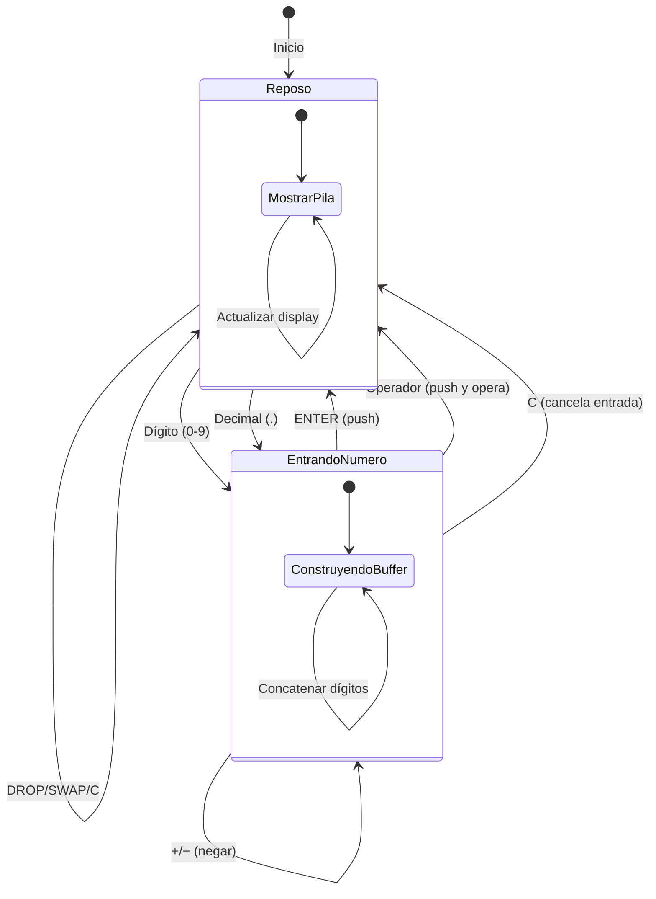
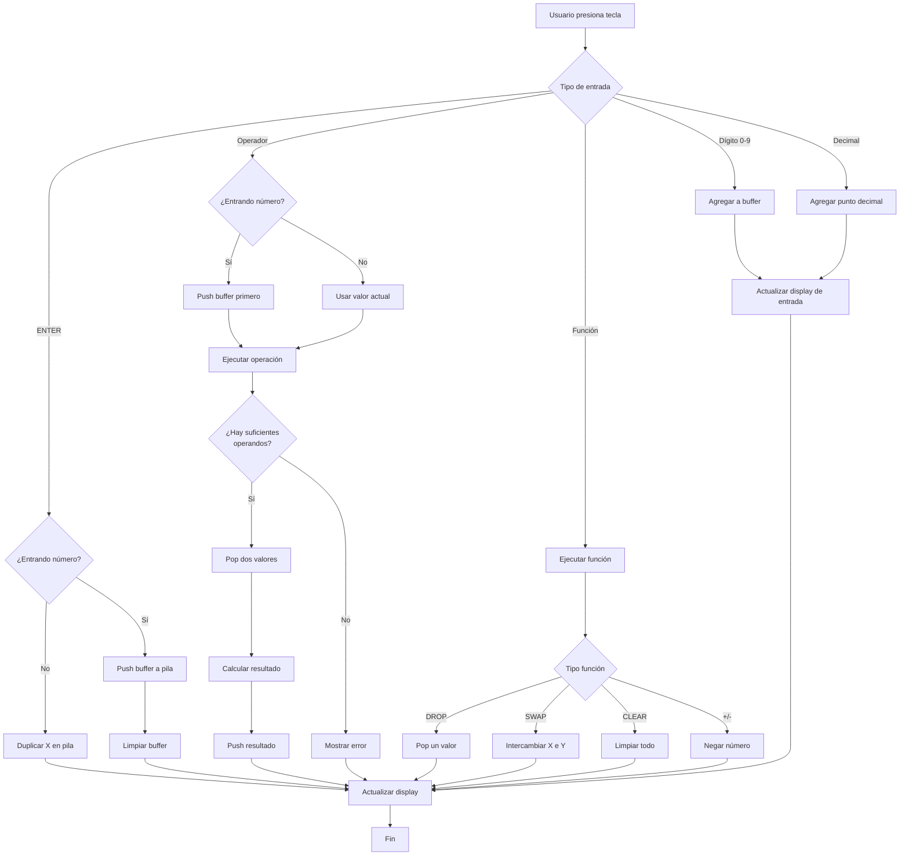
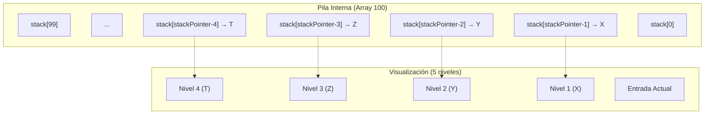
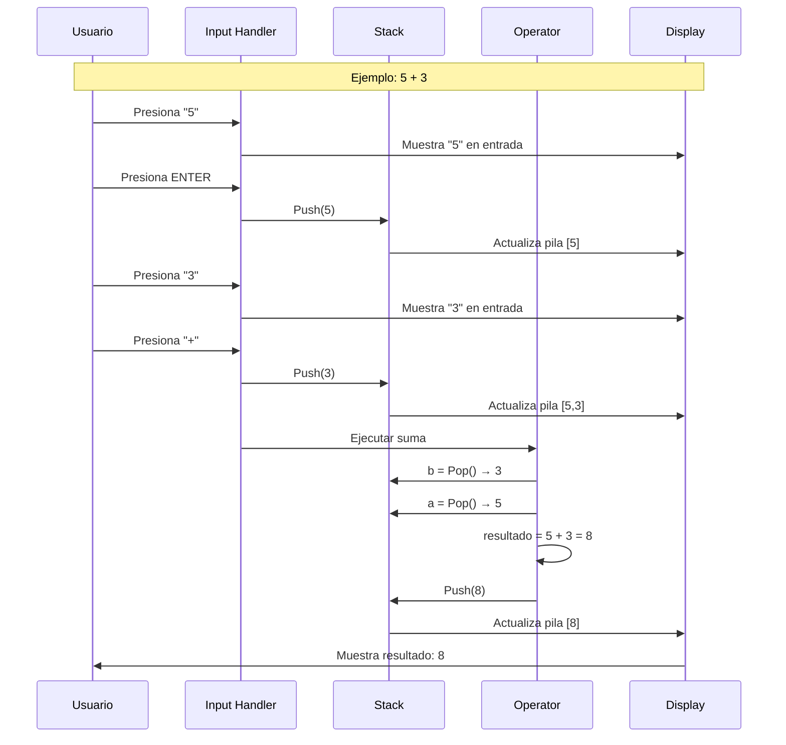
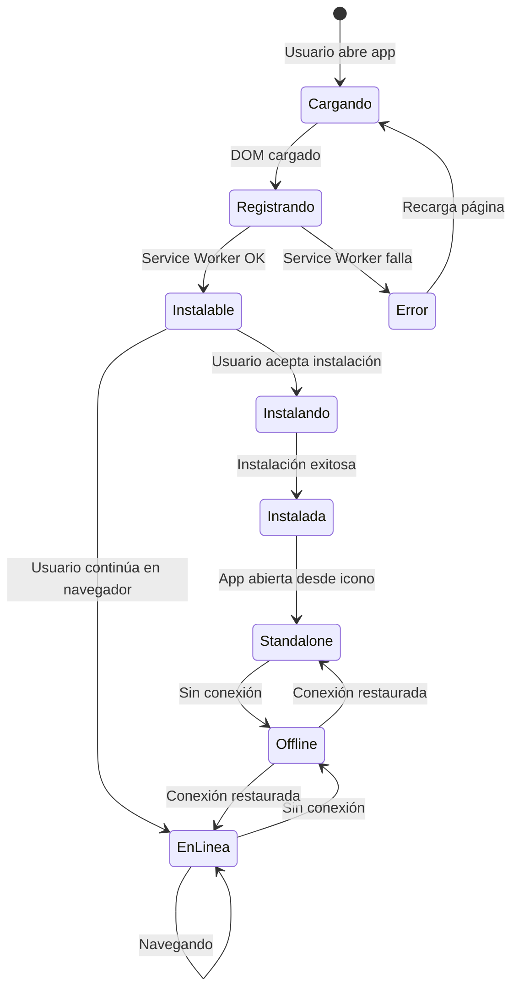
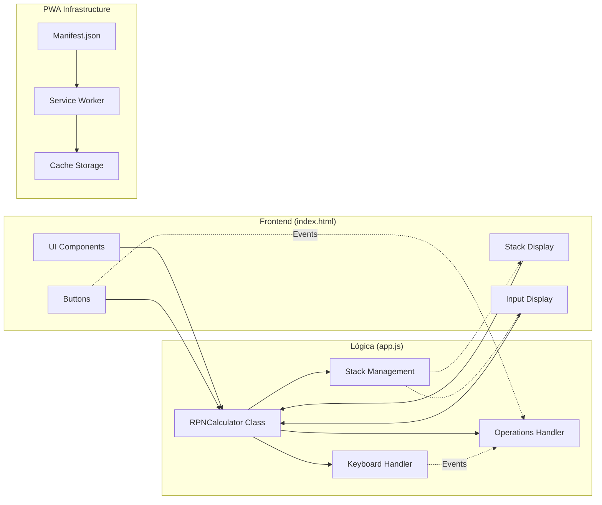

# Calculadora RPN - Progressive Web App

Calculadora con notación polaca inversa (RPN) estilo HP, implementada como Progressive Web App.

## Características

- **Pila de 100 entradas** con visualización de 5 niveles
- **Operaciones aritméticas básicas**: suma, resta, multiplicación y división
- **Funciones especiales**:
  - ENTER: Introduce valor en la pila
  - DROP: Elimina el último valor
  - SWAP: Intercambia los dos últimos valores
  - +/−: Cambia el signo del número
  - C: Limpia la entrada o toda la pila
- **Soporte de teclado**: Números, operadores, Enter, Escape, Backspace, S (swap)
- **Diseño moderno** con botones redondos y colores vibrantes
- **PWA completa**: Instalable y funciona offline
- **Responsive**: Se adapta a diferentes tamaños de pantalla

## Cómo usar

### Instalación

1. Abre `index.html` en un navegador web
2. Para generar los iconos, abre `generate-icons.html` y descarga los iconos
3. Coloca los iconos descargados en la carpeta raíz

### Uso como PWA

1. Abre la aplicación en un navegador compatible (Chrome, Edge, Safari)
2. Busca la opción "Instalar" o el prompt de instalación
3. Una vez instalada, podrás acceder desde tu escritorio o pantalla de inicio

### Operaciones básicas

La notación polaca inversa funciona así:
1. Introduce el primer número y presiona ENTER
2. Introduce el segundo número
3. Presiona el operador (+, −, ×, ÷)

**Ejemplo**: Para calcular 5 + 3:
- Escribe `5` → ENTER
- Escribe `3`
- Presiona `+`
- Resultado: `8`

## Arquitectura y Funcionamiento

### Máquina de Estados de Entrada

La calculadora implementa una máquina de estados para gestionar la entrada de números y operaciones:



### Flujo de Operaciones



### Estructura de la Pila

La calculadora mantiene una pila de 100 elementos y visualiza los 5 superiores:



### Operaciones Aritméticas



### Ciclo de Vida de la PWA



### Arquitectura de Componentes



## Tecnologías

- HTML5
- CSS3 (con diseño moderno y gradientes)
- JavaScript ES6+ (Clases, Service Workers)
- PWA (Service Worker, Manifest)

## Estructura del proyecto

```
calc-polaca/
├── index.html              # Estructura principal
├── styles.css              # Estilos modernos
├── app.js                  # Lógica de la calculadora
├── manifest.json           # Configuración PWA
├── service-worker.js       # Service Worker para offline
├── generate-icons.html     # Generador de iconos
├── icon-192.png           # Icono 192x192
├── icon-512.png           # Icono 512x512
└── README.md              # Este archivo
```

## Desarrollo

Para servir la aplicación localmente, puedes usar cualquier servidor HTTP simple:

```bash
# Con Python 3
python -m http.server 8000

# Con Node.js (npx)
npx serve

# Con PHP
php -S localhost:8000
```

Luego abre `http://localhost:8000` en tu navegador.

## Licencia

MIT License
